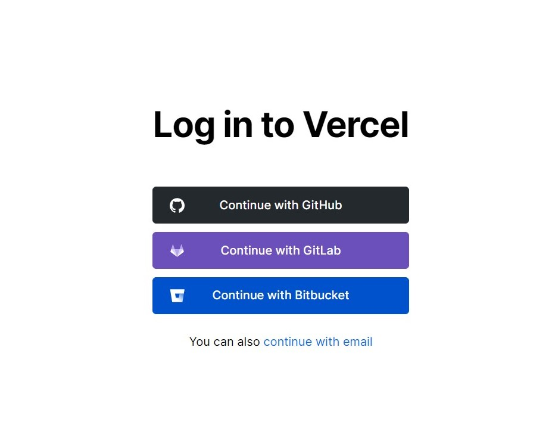
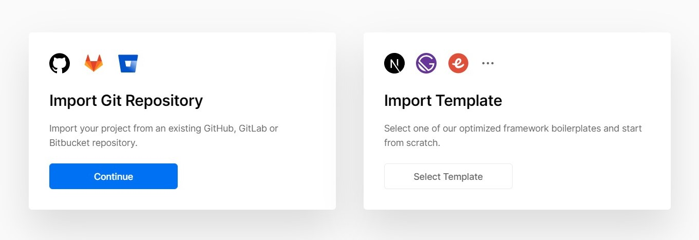
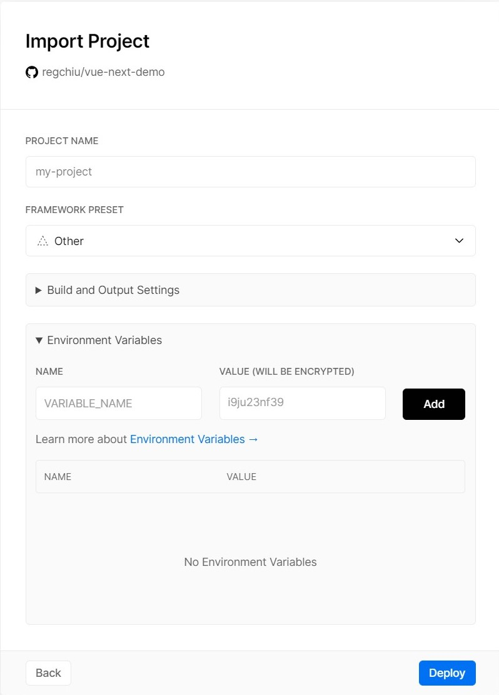

<p align="center">
  
</p>

# Spotify Currently Playing Track

Dynamically generate Spotify currently playing tracks for your github readme or everywhere.

## Overview

[](https://spotify-currently-playing-track.vercel.app/api)

### How to use

#### 1. Go to [Spotify Dashboard](https://developer.spotify.com/dashboard/) create an app.

1. Go **edit settings** and add **Redirect URIs**.
   i.e. White-listed addresses to redirect to after authentication success OR failure.
   For example development is http://localhost:3000, production is https://spotify-currently-playing-track.vercel.app/api.

1. Rename `.env.example` to `.env` file.
   Copy **Redirect URIs**, **Client ID**, **Client Secret** and paste into `YOUR_REDIRECT_URI` ,`YOUR_CLIENT_ID` and `YOUR_CLIENT_SECRET` field.

#### 2. Installation

```
$ npm install
```

#### 3. Get Authorize URL

```
$ npm run get-authorize-url
```

Paste the entire link into your browser and copy the url query string named **"code"**.

#### 4. Get Refresh Token

```
$ npm run get-refresh-token <code>
```

Copy and paste it into the `YOUR_REFRESH_TOKEN` field.

#### 5. Run start

```
$ npm run start
```

### Deploy on your Vercel

1. [Sign in](https://vercel.com/login) with GitHub by Continue with GitHub.



2. Fork this repo.

3. [Import project](https://vercel.com/import) and select **Import Git Repository**.



Allow access to your repository, if prompted.

4. Select root and keep everything default, then add `YOUR_CLIENT_ID`, `YOUR_CLIENT_SECRET` and `YOUR_REFRESH_TOKEN` of **Environment Variables**.



5. Click deploy, and see your domains to use the API! Replace overview link with your URL. enjoy! :tada:

## Known Bug :bug:

[Layer content inside HTML in SVG foreignObject renders in the wrong place](https://bugs.webkit.org/show_bug.cgi?id=23113)
